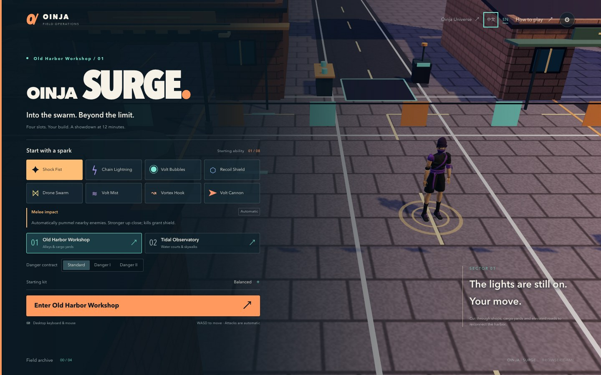
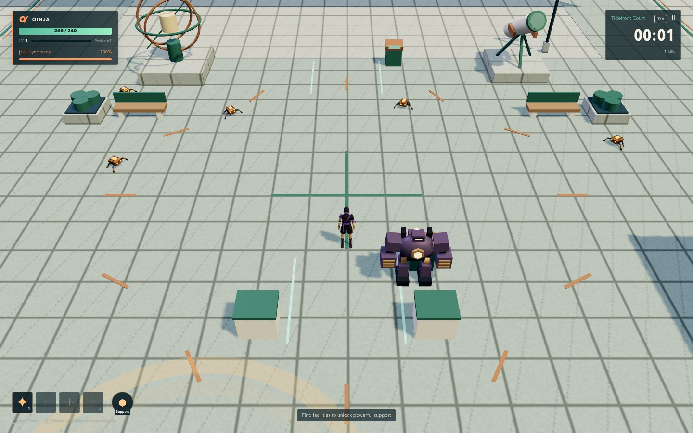

<div align="center">
  
  <h1>SURGE for Oinja · 电涌</h1>
  <p><strong>冲进怪潮。让回路失控。</strong></p>
  <p>Oinja 宇宙中的第三人称生存游戏。<br />构筑雷电与机械的联动，迎战怪潮，让回路持续运转。</p>
  <p><a href="https://oinja-game.vercel.app"><strong>直接开始游戏 ↗</strong></a> · <a href="https://oinja-website.vercel.app">探索 Oinja 宇宙 ↗</a></p>
  <p><a href="README.md">English</a> · <strong>简体中文</strong></p>
</div>

[](https://oinja-game.vercel.app)

> [!NOTE]
> 面向电脑浏览器和键盘操作，无需安装或注册即可游玩。目前不支持手机触屏操作。

## 构筑属于你的回路

从 **八种初始能力** 中任选一种，逐渐填满 **四个能力槽**，再加入一个独立的 **地图支援槽**，让单独的攻击变成相互联动的构筑。

- **能力彼此改变玩法。** 钩索把敌群拉进重拳范围，爆破消耗导电标记，连雷点燃雷雾。五条自动连携让搭配产生不同效果。
- **选择会改变这局。** 每种能力有两条进化路线，另有 14 类改装、重抽和继承已投入等级的能力替换。
- **紧凑的生存流程。** 五种基础敌人、精英与第 12 分钟登场的首领；在第 15 分钟时限前击败首领。标准难度保留一次应急复起，危险 I / II 提供更强压力。
- **四格之外的战力。** 地图设施可以解锁工坊泰坦、临界雷暴、轨道电炮等支援。

攻击自动发动。你负责走位、闪避、聚怪、选择升级，以及掌握 **同调爆发** 的时机。

## 两张地图，两种路线

| 旧港工坊 | 潮汐观测庭 |
| --- | --- |
| 街巷、货场、店铺、坡道与高架下通路。 | 温室、水庭、观测装置与宽缓坡连接的高架环廊。 |
| 恢复供电、打开捷径，利用工业设备清理敌群。 | 环绕庭院、穿行上下层，在开阔路线中聚集怪潮。 |

每张地图有 **12 处候选设施**，每局从六类设施中各选一处。修复工坊、护送车、吊机、输送线和有守卫的储备箱，让你有理由走出熟悉的绕圈路线。



沿途还可能遇到四种可自愿接取的随机事件：

| 事件 | 玩法 |
| --- | --- |
| 磁暴猎场 | 在标记区域内保持连续击杀。 |
| 流动电池 | 按顺序到达多个回收点。 |
| 过载交换 | 交出护盾和少量生命，承担短暂风险，换取之后的伤害增益。 |
| 故障分身 | 在时限内追猎两个指定精英。 |

奖励包括治疗、护盾、同调能量和限时增益。这些随机事件不占用地图支援槽。

## 操作

| 按键 | 动作 |
| --- | --- |
| **WASD** / **方向键** | 移动 |
| **空格** | 闪避 |
| **Q** | 能量满后释放同调爆发 |
| **E** | 操作附近设施或接取随机事件 |
| **1 / 2 / 3** | 选择升级 |
| **R** | 重抽升级选项 |
| **Tab** / **M** | 打开地图 |
| **Esc** | 暂停或返回 |

查看地图和升级选卡时，战斗暂停。镜头自动跟随角色。

## 语言与存档

首次进入时，游戏按浏览器的语言偏好选择支持的 **English** 或 **简体中文**。中文地区变体统一使用简体中文；没有匹配语言时回退为英文。你可以在菜单或设置里手动切换，之后优先使用保存的选择。

行动进度、设置和解锁内容保存在 **当前浏览器**。刷新后选择「继续行动」即可恢复。游戏没有账户或云端同步，清除浏览器存储会移除该浏览器中的进度。

## 本地运行

需要 **Node.js 22** 和 npm。克隆需要仓库访问权限；[线上游戏](https://oinja-game.vercel.app) 可以公开游玩。

```sh
git clone https://github.com/Olivia295/SURGE-for-Oinja.git
cd SURGE-for-Oinja
npm ci
npm run dev
```

打开 Vite 输出的本地地址。检查并预览正式构建：

```sh
npm test
npm run build
npm run preview -- --port 4180
```

`npm run build` 包含 TypeScript 检查。项目使用 **Three.js、Rapier、TypeScript 和 Vite**，不需要应用后端或 API 密钥。

## 项目结构

| 路径 | 用途 |
| --- | --- |
| `src/surge/` | 当前游戏的战斗、成长、地图、渲染、界面与翻译 |
| `src/physics/` | Rapier 移动与碰撞 |
| `public/assets/` | 游戏模型与素材 |
| `tests/` | 自动规则与回归检查 |
| `tools/surge/` | 浏览器检查、导航验证和自动试玩 |
| `docs/` | 以中文为主的设计与验证文档 |

可从 [0.4 设计与验证说明](docs/15-worlds-events-and-language.md) 或 [潮汐观测庭地图说明](docs/observatory-map.md) 开始阅读。早期文档记录早期版本，不代表当前功能清单。本地历史归档、原始建模文件和自动生成的验证记录不进入 Git。

现有检查覆盖游戏规则、导航、语言和保存恢复。已验证桌面 Chrome；自动整局不等同于真人平衡测试，也不代表所有浏览器都已验证。

## 发布

公开地址保持为 **[oinja-game.vercel.app](https://oinja-game.vercel.app)**。采用手动部署，推送 GitHub 不会自动发布。在已连接作者 Vercel 项目的工作副本中执行：

```sh
npm test
npm run build
npx vercel deploy --prod --yes
```

构建配置在 `vercel.json`。`.vercelignore` 排除本地记录、内部文档和未使用的旧版环境资源。

---

**Oinja 宇宙的一部分。** 游戏保留 Oinja 的机械与雷电身份；战斗机制、支援机械和可玩地图属于玩法改编，不自动加入角色原作设定。角色与世界故事见 [Oinja 档案馆](https://oinja-website.vercel.app)。
