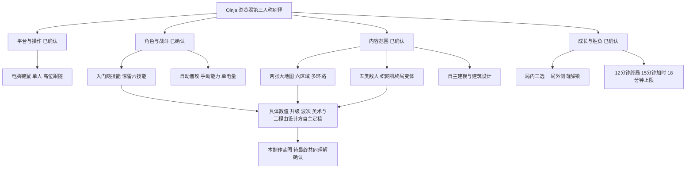

# 最终制作蓝图

版本：0.1 · 2026-09-17  
状态：待用户确认共同理解；尚未实施。设计数值与性能指标为调试起点。

## 核心体验

玩家扮演 Oinja，在层次丰富的港区中聚怪、穿越、反击，通过机械右臂与雷电左臂交替作战。自动普攻维持战斗节奏，手动技能决定突破方向、爆发窗口与脱险方式。成长让一局从谨慎绕行逐渐变成主动操控怪群，终局要求把整局形成的打法用于一个有清晰弱点的强敌。

游戏采用广潮工业港环境与 Oinja 成熟游戏技能为改编基础。关卡名、五种机械敌人、战斗任务和重复挑战属于本游戏新增内容，不作为原作新篇章或对 Canon 的修改。

工作标题为 **Oinja：惊雷回路**，项目文件夹固定为 **Oinja-game**。

## 首版完整范围

| 项目 | 内容 |
|---|---|
| 平台 | 电脑浏览器，键鼠，单人 |
| 角色 | Oinja 基础装 O-01；可动画的自主建模角色 |
| 镜头 | 高位、拉远、可旋转的第三人称跟随；碰撞避障与重置 |
| 模式 | 入门、惊雷；两者均有完整局内成长及胜负结算 |
| 地图 | 潮锈旧港、霁电新港，开局均可选择 |
| 敌人 | 严格五种行为原型；精英与终局使用现有原型的变体 |
| 时长 | 12 分钟终局入场；目标约 15 分钟通关；最多 18 分钟 |
| 成长 | 击杀掉经验，升级暂停后三选一，技能有进化分支 |
| 局外 | 本地记录、成就、侧向构筑选项与少量外观；战斗属性重置 |
| 交付 | 可玩的浏览器构建、完整工程、建模源文件、运行资产、验证记录 |

在线多人、手机触屏和云账号不在已确认首版范围。两张地图和两种模式都属于首版验收范围，制作过程可以分阶段验证，不能把只完成一张图的中间版本称为首版完成。

## 两种模式

| 规则 | 入门 | 惊雷 |
|---|---|---|
| 初始技能 | 右臂三选一、左臂三选一，全部九种组合可选 | 六项主动技能从开局全部可用 |
| 自动内容 | 当前手臂的普通攻击与强化普攻 | 同左 |
| 手动内容 | 所选两项技能 | 六项技能 |
| 未装备能力 | 不会暗中自动施放，不进入升级池 | 全部可升级 |
| 同调、回电、机械演进 | 保留；屏障强化仅在选有屏障时出现 | 完整保留 |
| 成长体验 | 把资源集中投入少量技能，建立清晰流派 | 选择专精，同时调度更多基础能力 |
| 敌方规则 | 共用敌人机制、波次时刻与终局目标 | 同左 |
| 平衡 | 独立调整模式系数与成长分配，目标为同档挑战 | 同左 |

“完整复刻”落实到六项核心能力及其联动。蓝量取消、机械演进每局重置等已确认改编继续适用。伤害、冷却与升级按刷怪环境重新平衡，不宣称沿用原作文件即已验证平衡。

默认入门推荐搭配为钩爪鞭＋雷电冲击：先牵引一个关键目标，再用连锁处理聚集敌人。其余八种组合都必须可用；盾＋屏障组合主要依靠普攻、护盾反射和稳定站位成长，不强迫玩家另装输出技能。

## 一局的流程

1. 选择地图与模式；入门选择两项技能。首局提供可跳过的简短操作提示。
2. 从广场安全入口出发，击杀、拾取经验、熟悉附近一条环路。
3. 升级时暂停世界，从三个有效选项中选择。每张卡明确当前效果、变化及适用手臂。
4. 可选事件出现在不同区域，提供经验、回复或重抽机会；路线选择始终有代价。
5. 中期形成一至两个技能进化，利用地形应对五种敌人的组合。
6. 12 分钟终局织网主机到场；地图继续可走，主机所在区域明确标记。
7. 击败主机立即胜利；死亡或 18 分钟到时失败。结算显示构筑、击杀、受伤原因和进步记录。

大地图服务于路线选择。玩家不必清空所有区域或跑遍地图才能进入终局。

## 地图与美术方向

两图共享可学习的结构：六片主区域、地面双环、横向捷径、上层绕行。每图独立制作建筑轮廓、室内出入口、地形标高、掩体关系与事件表现。

- **潮锈旧港**：砖混仓库、铆接栈桥、船体骨架、修船坞、锈蚀货柜与临时配电设施。傍晚暖色作业灯与冷色海雾形成层次。
- **霁电新港**：模块化货柜塔、白灰混凝土转运大厅、冷却渠、封闭管廊、储能站与自动装卸设施。晴朗的冷灰环境与琥珀警示色保持清晰。

Oinja 维持成年正常比例、黑紫服装、肤色机械右臂、有机符文左臂和斜置 B7 包。敌人靠身体轮廓、动作与攻击预警区分。紫电优先代表玩家能力，敌方危险以暖橙红搭配图形与声音提示。

## 设计树及关闭方式

Q1–Q21 已没有待答分支；具体制作细节的决定权已由用户授予设计方。最终确认通过后进入制作，不为日常数值调整、建筑细节或常规修复反复要求用户决策。

## 完成的判定

首版完成需要同时满足：两图×两模式均可从开始玩到结算；五种敌人均具有不同、可反制的行为；Oinja 核心视觉与技能联动通过检查；角色和敌人有正式动画；地图多环路真实连通；性能在记录设备上通过实测；没有阻止通关、穿地、失控或存档破坏问题。

详细门槛、阶段交付和证据要求见 [工程与验收](06-engineering-and-acceptance.zh-CN.md)。
