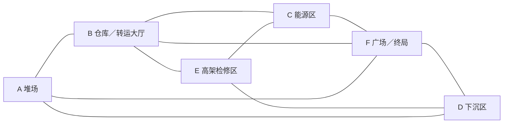

# 两张大地图与动态事件

版本：0.1。地图名称、尺寸与局部空间是本游戏新设计，不重写广潮原作地理。首版两张图都完整制作；使用相同结构语言，分别设计建筑和战斗空间。

## 共同空间规则

- 潮锈旧港初始占地约 480×400 米；霁电新港约 500×420 米，尺寸允许根据灰盒试玩调整。
- 每图六个主区域，区域内各含约 3 个有战术差别的小空间。可走面积集中在连通战场，海面与远景工业设施用于环境深度。
- 地面主要通道宽 8–14 米，局部侧路宽 4–6 米；常规高架宽 5–8 米，避免刷怪密度把所有桥变成必死单行线。
- 主战场至少两条常规出路。所有关键区域、事件和终局可不使用钩爪到达；高层有坡道或楼梯，钩爪只提供更短转移。
- 除极短、可见回头路的拾取角落，不做用于刷怪的死胡同。窄通道两端应能看到出口线索。
- 玩家从一个有意义的空间转到下一个约需 8–20 秒；步行跨主要地图目标约 45–70 秒。大地图不能靠空旷长跑填充。
- 主地面 0 米，下沉区约 −5 米，上层约 +6～+12 米。楼层碰撞、导航与攻击遮挡均明确。
- 空间内有建筑、设备、管线、可破坏小物和环境声，但战斗地面保留连续可读区域。小装饰不能形成不可见卡点。
- 海岸、深水与不可到达远景使用符合场景的护栏、坡岸和挡坎。意外落出地形回到最近安全点并扣 10%最大生命；不得用恢复位置反复穿越锁闭捷径。

## 共用拓扑

- 地面西环：A→B→F→D→A。
- 地面东环：B→C→F→B。
- 外围大环：A→B→C→F→D→A。
- 上层绕行：B→E→C；E→D 提供另一方向出口，与地面共同闭环。
- A↔F 的近路可由事件打开；没有打开时两条主要地面环路已经连通。
- E 与地面连接均有常规坡道。钩爪锚点增加平行的快捷边，不取代步行边。
- 上图是结构关系示意，关卡摆位需要各自设计，不能把两图的建筑网格逐一换材质即交付。

## 地图一：潮锈旧港

傍晚的老港作业区。海风、船体、砖墙与修补痕迹形成生活过的工业环境；远景灯塔是方向标。环境光保持足够亮度，暗部不能吞掉 Oinja 的黑衣或敌人脚部预警。

| 区域 | 独立建筑与地标 | 三类局部空间 | 主要玩法 |
|---|---|---|---|
| A 旧轨堆场 | 锈蚀货柜、废弃轨道、检修棚、起重机底座 | 宽装卸面／折线货柜巷／低矮货台 | 练习聚怪，炮击穿列，货柜打断远程视线 |
| B 红砖货仓 | 锯齿采光顶、砖柱、木钢货架、双层装卸门 | 贯通中央通道／侧仓绕行／上层挑台 | 近身换位，主动选择多出口通路 |
| C 临时配电场 | 修补配电房、储电箱棚、地上桥架 | 开阔设备庭／配电房外绕道／抬高检修平台 | 设备掩体与有预警的地面危险 |
| D 干船坞 | 下沉坞底、半修船体、排水坡与双侧作业台 | 宽坞底／船体两侧／南北坡道 | 上下层夹击、借船体遮挡，两个方向退出 |
| E 铆接检修桥 | 锈钢桁架、吊机维修架、栈桥控制屋 | 桥上长线／中段扩宽平台／桥下短环 | 钩爪转移、控制长视线、上下路线切换 |
| F 临海装卸广场 | 旧港务小楼、泊位系缆柱、吊机与海堤 | 中央终局场／建筑侧院／滨海回环 | 早期安全辨路、后期大群战与主机 |

建筑可进入区域至少包括主货仓、控制屋和配电房的可穿行部分。远景船舱不开放时应有清楚的关闭结构，不制作暗示可进入却无说明的门。

旧港特色事件表现：

1. **恢复作业电路**：在 C 区持续交互 3 秒启动，守住附近 25 秒后灯具恢复，A↔F 货门打开；奖励经验。
2. **放下检修桥**：E 区开关启动 8 秒机械运动，声光提示后接通 E↔D 的额外短桥；原有坡道始终可走。
3. **回收储电箱**：A 或 B 的一次性箱体在交互后触发小规模五类内遭遇；完成后选择修复件或一次重抽。

## 地图二：霁电新港

现代工业港，明亮天空与冷灰海面。白灰混凝土、浅色涂装钢构和设备编号与旧港明显区分；大型港机轮廓与远景风机成为方向参照。紫色留给 Oinja，场景导向使用青白或琥珀。

| 区域 | 独立建筑与地标 | 三类局部空间 | 与旧港的战术区别 |
|---|---|---|---|
| A 自动货柜区 | 竖向货柜塔、龙门转运架、分拣岛 | 纵向长通道／塔脚横穿带／机器侧院 | 较长炮击视线，更多横向切入点 |
| B 转运大厅 | 大跨度屋面、玻璃高窗、装卸泊位 | 明亮中庭／支柱绕行／双翼通廊 | 中央视线开放，两翼提供连续遮挡 |
| C 模块储能站 | 电池舱、独立冷却机、变电围护 | 并列机组间／宽检修前场／外圈保养路 | 规则间距可预测，特殊敌人占位更明显 |
| D 冷却检修庭 | 低水位明渠、下沉设备台、双坡道 | 渠侧步道／设备台间／横向维修桥 | 通过桥位选择战场，水面不作为可走面 |
| E 管廊与高架 | 混凝土高架、封闭透明局部管廊、维护塔 | 高架直段／管廊内折转／塔脚回环 | 明暗过渡与分层遮挡，出口位置不同 |
| F 工业中庭 | 调度楼底层、装卸平台、港机基座 | 中央终局面／调度楼穿堂／外围半环 | 地面更宽，以柱体和平台创造绕侧窗口 |

新港特色事件表现：

1. **恢复分区供电**：C 区启动后在两处相邻设备间移动完成 25 秒校准；改变附近照明并打开 A↔F 转运闸门。
2. **重置转运通道**：B 区机械隔板移动，8 秒预警后打开一条横向路线；另一条永久路线不关闭。
3. **吊运补给舱**：F 或 E 邻近位置发出到货提示，守住 25 秒后补给落地；奖励与旧港储电箱一致。

两图使用相近的事件收益预算，机械运动和区域表现独立制作。传送带、吊机与远景风机的运动主要表达场景活力，不要求引入复杂全场刚体模拟。

## 事件导演与路线价值

- 每局从本图三个事件中抽取两个，分别约在 2:00、6:00 激活；10:00 提供一次小补给提示。固定地图、变动事件落点及出现组合。
- 同时最多一个大型事件可接受，地图与世界信标共同标记。玩家可无代价忽略，终局不要求全部完成。
- 大事件交互需要 3 秒，可被玩家移动取消；战斗波次继续。事件开始后 25 秒占区，离开范围暂停进度，允许返回；超过 90 秒整体失效。
- 大事件奖励 120 经验与一次修复件／重抽二选一；小补给为修复件。每项每局领取一次。
- 完成后改变路线的门桥保持开启到本局结束；失败不会破坏原有必经通路。
- 机关运动前预警，移动过程中不把玩家夹入墙体。过道有人时延迟闭合；本版尽量以“打开新路”为主，避免动态封死已走路径。
- 基础可破坏物仅使用木箱、细金属罐等局部资产，不伤害主通路连通性；大型建筑不做全破坏。
- 少量爆裂储电罐先标明危险，受击后延时爆炸，伤害双方；击杀归地图，不产主动技能专属成长。每区域数量受限，不承担无限资源来源。

## 镜头与多层可读性

- 建筑遮挡角色时先由镜头碰撞推近，再对近处屋顶／墙面作局部淡化。淡化只改渲染，不删除碰撞或允许攻击穿墙。
- 室内高架同屏时区分脚下导航层，不让楼上经验吸到楼下，也不让敌人隔地板伤害。
- 背后攻击用边缘方向提示；悬机和冲锋即使部分被装饰遮挡，预警仍需可辨。
- 常规镜头下至少能看见前方躲避空间和角色全身主要轮廓；拐角时不突然反转控制方向。
- 地图默认收起；Tab 展开后暂停，并显示当前层、终局位置、事件、已开的捷径和玩家朝向。

## 地图验收

两图分别证明：不用钩爪完成全部主路线；两个地面环与一条上层环确实闭合；门桥切换不困住玩家或敌人；六区域各有独立地标与三个战术小空间；建筑碰撞匹配；普通与终局遭遇都能抵达。

需要每张图的俯视布局截图、六区域代表画面、至少一段完整巡游记录及两种模式的通关记录。完整地图的交付不能只用平面布点或远景建筑证明。
